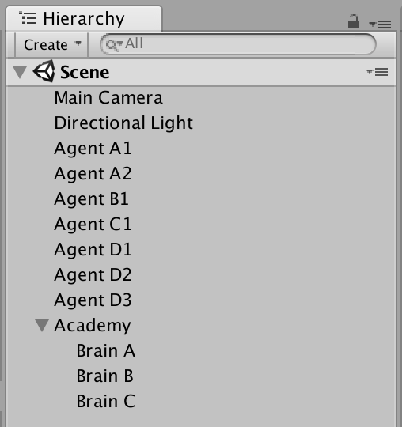

# Organizing the Scene Layout

This tutorial will help you understand how to organize your scene when using Agents in your Unity environment.

## ML-Agents Game Objects

There are three kinds of game objects you need to include in your scene in order to use Unity ML-Agents:
 * Academy  
 * Brain  
 * Agents  

#### Keep in mind :   
 * There can only be one Academy game object in a scene.   
 * You can have multiple Brain game objects but they must be child of the Academy game object.  

#### Here is an example of what your scene hierarchy should look like :  

### Functionality

#### The Academy
The Academy is responsible for:
* Synchronizing the environment and keeping all agent's steps in pace. As such, there can only be one per scene. 
* Determining the speed of the engine, its quality, and the display's resolution. 
* Modifying the environment at every step and every reset according to the logic defined in `AcademyStep()` and `AcademyReset()`. 
* Coordinating the Brains which must be set as children of the Academy.

#### Brains
Each brain corresponds to a specific Decision-making method. This often aligns with a specific neural network model. A Brains is responsible for deciding the action of all the Agents which are linked to it. There can be multiple brains in the same scene and multiple agents can subscribe to the same brain. 

#### Agents
Each agent within a scene takes actions according to the decisions provided by it's linked Brain. There can be as many Agents of as many types as you like in the scene. The state size and action size of each agent must match the brain's parameters in order for the Brain to decide actions for it.
