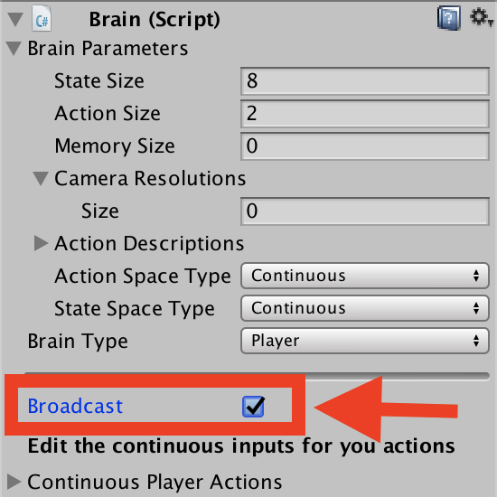

# Using the Broadcast Feature
The Player, Heuristic and Internal brains have been updated to support broadcast. The broadcast feature allows you to collect data from your agents in python without controling them.  
## How to use : Unity
To turn it on in Unity, simply check the `Broadcast` box as shown bellow:

## How to use : Python 
When you launch your Unity Environment from python, you can see what the agents connected to non-external brains are doing. When calling `step` or `reset` on your environment, you retrieve a dictionary from brain names to `BrainInfo` objects. Each `BrainInfo` the non-external brains set to broadcast.  
Just like with an external brain, the `BrainInfo` object contains the fields for `observations`, `states`, `memories`,`rewards`, `local_done`, `agents` and `previous_actions`. Note that `previous_actions` corresponds to the actions that were taken by the agents at the previous step, not the current one.  
Note that when you do a `step` on the environment, you cannot provide actions for non-external brains. If there are no external brains in the scene, simply call `step()` with no arguments.  
You can use the broadcast feature to collect data generated by Player, Heuristics or Internal brains game sessions. You can then use this data to train an agent in a supervised context.
