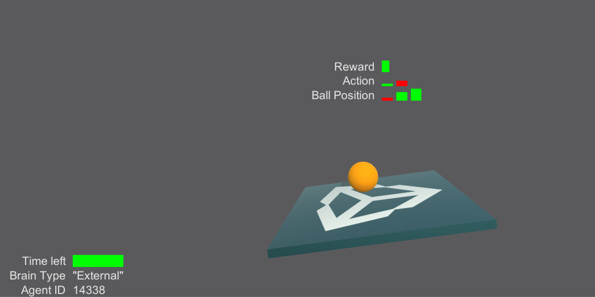

# Using the Monitor



The monitor allows visualizing information related to the agents or training process within a Unity scene. 

You can track many different things both related and unrelated to the agents themselves. To use the Monitor, call the Log function anywhere in your code :
```csharp
   Monitor.Log(key, value, displayType , target)
```
 * *`key`* is the name of the information you want to display.
 * *`value`* is the information you want to display.
 * *`displayType`* is a MonitorType that can be either `text`, `slider`, `bar` or `hist`.
   * `text` will convert `value` into a string and display it. It can be useful for displaying error messages!
   * `slider` is used to display a single float between -1 and 1. Note that value must be a float if you want to use a slider. If the value is positive, the slider will be green, if the value is negative, the slider will be red.
   * `hist` is used to display multiple floats. Note that value must be a list or array of floats. The Histogram will be a sequence of vertical sliders.
   * `bar` is used to see the proportions. Note that value must be a list or array of positive floats. For each float in values, a rectangle of width of value divided by the sum of all values will be show. It is best for visualizing values that sum to 1.
 * *`target`* is the transform to which you want to attach information. If the transform is `null` the information will be attached to the global monitor.
