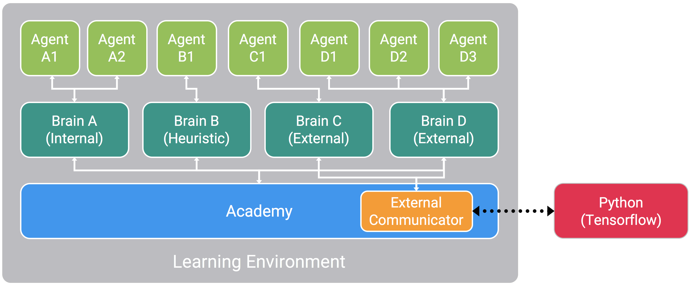

# Unity ML - Agents (Editor SDK)

## Unity Setup
Make sure you have Unity 2017.1 or later installed. Download link available [here](https://store.unity.com/download?ref=update).

### Building a Unity Environment
- (1) Open the project in the Unity editor *(If this is not first time running Unity, you'll be able to skip most of these immediate steps, choose directly from the list of recently opened projects and jump directly to )*
    - On the initial dialog, choose `Open` on the top options
    - On the file dialog, choose `ProjectName` and click `Open` *(It is safe to ignore any warning message about non-matching editor installation")*
    - Once the project is open, on the `Project` panel (bottom of the tool), click the top folder for `Assets`
    - Double-click the scene icon (Unity logo) to load all game assets
- (2) *File -> Build Settings*
- (3) Choose your target platform:
- (opt) Select “Developer Build” to log debug messages.
- (4) Set architecture: `X86_64`
- (5) Click *Build*:
    - Save environment binary to a sub-directory containing the model to use for training *(you may need to click on the down arrow on the file chooser to be able to select that folder)*

## Example Projects
The `Examples` subfolder contains a set of example environments to use either as starting points or templates for designing your own environments.
* **3DBalanceBall** - Physics-based game where the agent must rotate a 3D-platform to keep a ball in the air. Supports both discrete and continuous control.
* **GridWorld** - A simple gridworld containing regions which provide positive and negative reward. The agent must learn to move to the rewarding regions (green) and avoid the negatively rewarding ones (red). Supports discrete control.
* **Tennis** - An adversarial game where two agents control rackets, which must be used to bounce a ball back and forth between them. Supports continuous control.

For more informoation on each of these environments, see this [documentation page](../docs/Example-Environments.md).

Within `ML-Agents/Template` there also exists:
* **Template** - An empty Unity scene with a single _Academy_, _Brain_, and _Agent_. Designed to be used as a template for new environments.

## Agents SDK
A link to Unity package containing the Agents SDK for Unity 2017.1 can be downloaded here :
 * [ML-Agents package without TensorflowSharp](https://s3.amazonaws.com/unity-agents/0.2/ML-AgentsNoPlugin.unitypackage)
 * [ML-Agents package with TensorflowSharp](https://s3.amazonaws.com/unity-agents/0.2/ML-AgentsWithPlugin.unitypackage)

For  information on the use of each script, see the comments and documentation within the files themselves, or read the [documentation](../../../wiki).

## Creating your own Unity Environment
For information on how to create a new Unity Environment, see the walkthrough [here](../docs/Making-a-new-Unity-Environment.md). If you have questions or run into issues, please feel free to create issues through the repo, and we will do our best to address them.

## Embedding Models with TensorflowSharp _[Experimental]_
If you will be using Tensorflow Sharp in Unity, you must:

1. Make sure you are using Unity 2017.1 or newer.
2. Make sure the TensorflowSharp [plugin](https://s3.amazonaws.com/unity-agents/0.2/TFSharpPlugin.unitypackage) is in your Asset folder.
3. Go to `Edit` -> `Project Settings` -> `Player`
4. For each of the platforms you target (**`PC, Mac and Linux Standalone`**, **`iOS`** or **`Android`**):
	1. Go into `Other Settings`.
	2. Select `Scripting Runtime Version` to `Experimental (.NET 4.6 Equivalent)`
	3. In `Scripting Defined Symbols`, add the flag `ENABLE_TENSORFLOW`
5. Restart the Unity Editor.
